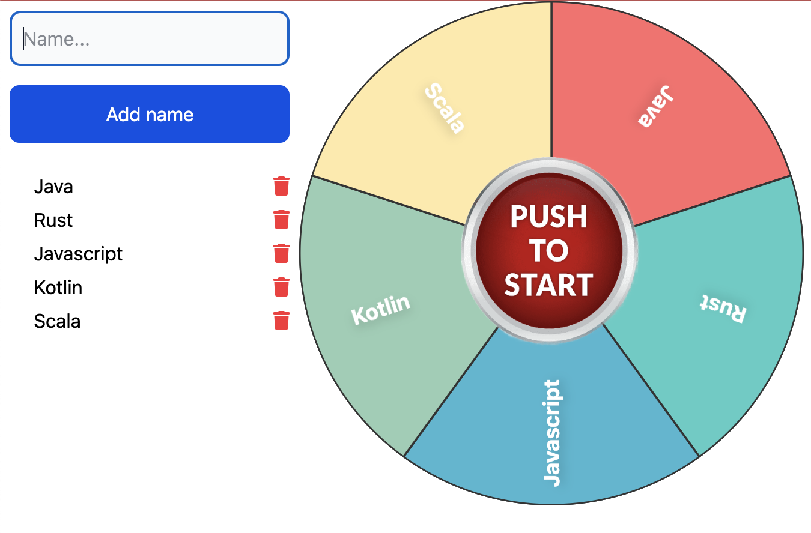
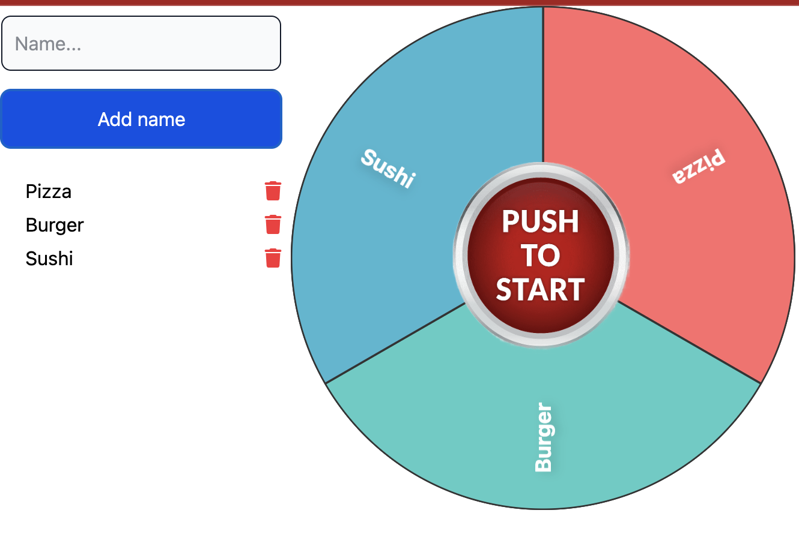

# Wheel of Fortune

## Introduction

-- JUST FOR FUN --

Currently just a small demonstration for applying with Leptos a rotating Text.

## Features

* adding / deleting items
* split the wheel in colors and parts
* speed control by defining waiting time and step size in rotation
* start button to start the wheel
* reducing speed with a random factor
* showing the current winning name during rotation

## Build

Release build for GitHub page:

```shell
trunk build --release --public-url="/wheel-of-fortune/"
```

and set the correct base reference 

```
<base href="/wheel-of-fortune/">
```

in the generated file.

## Demo

Test it on: https://oxide-byte.github.io/wheel-of-fortune/

## Samples


